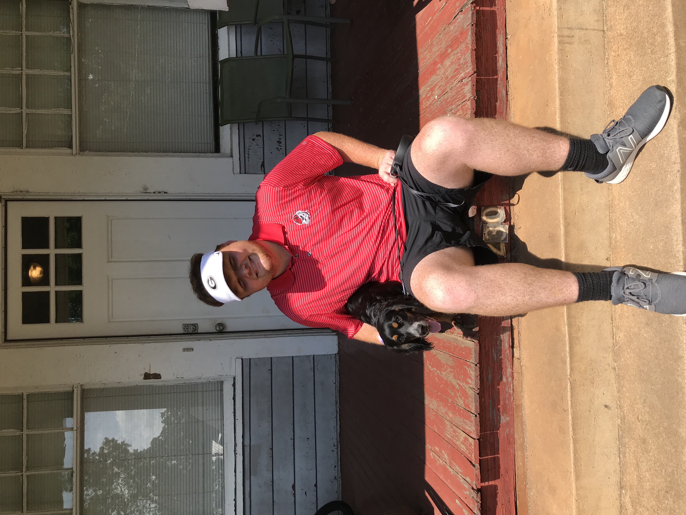

<!DOCTYPE HTML PUBLIC "-//W3C//DTD HTML 4.01//EN" "http://www.w3.org/TR/html4/strict.dtd">
<html>
<head>
<meta http-equiv="Content-Type" content="text/html; charset=utf-8">
	<title> Brooks Pinson's Webpage </title>
	
</head>
<body>
  <H1> Brooks Pinson's Webpage </H1>
  
 This webpage is all about me 

<small> Pictured above is me and my dog, Demi</small>

</html>
  
